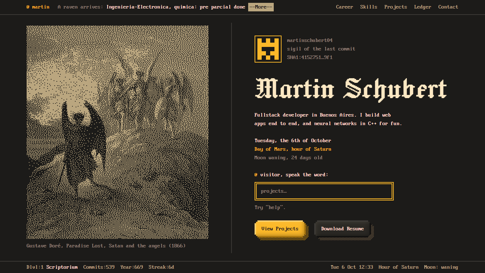
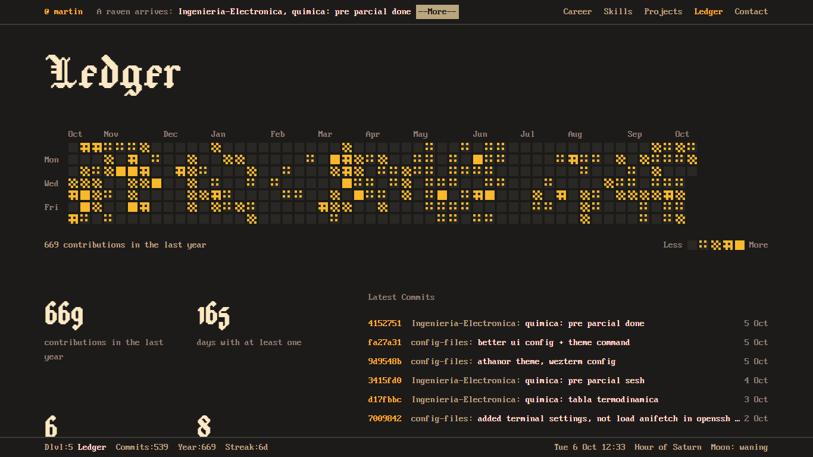

# portfolio-athanor

Portfolio de Martin Schubert con la identidad de su tema de terminal
[athanor](https://github.com/script-wizards/athanor): paleta Srcery, fuente IBM VGA 8x16, grabados de
dominio público en dos colores con dithering, y superficies de "pixel clay" (claymorphism dibujado
con recursos de pixel art).





## Qué tiene

- **Hero tipo pantalla de bloqueo.** Un grabado al azar (rota sin repetir), el sigilo del último
  commit, la fecha con hora planetaria y luna para Buenos Aires, y un prompt que entiende comandos:
  `projects`, `career`, `ledger`, `resume`, `github`, `plate`, `help`.
- **Un cuervo en la barra superior** que trae el último commit público.
- **Barra de estado estilo NetHack** con la sección actual como nivel de mazmorra, commits, racha y hora.
- **Carrera como salas de MUD**: título entre tildes, descripción, stack y links.
- **Proyectos en un navegador de archivos**: la captura arranca tramada y se "revela" a color.
- **Ledger**: calendario de contribuciones donde la intensidad es densidad de dithering, cifras
  calculadas (días activos, rachas, día más cargado) y los últimos commits con formato `git log`.

## Correrlo

```powershell
npm install
npm run dev      # http://localhost:5173
```

| Comando | Qué hace |
|---|---|
| `npm run dev` | Servidor de desarrollo |
| `npm run build` | Typecheck y build de producción en `dist/` |
| `npm run preview` | Sirve `dist/` |
| `npm run lint` | ESLint |
| `npm test` | Tests de `src/lib` con Vitest |
| `npm run plates` | Regenera las imágenes tramadas desde `art/` (necesita [ImageMagick](https://imagemagick.org/)) |

## Actualizar contenido

Todo el contenido vive en `src/data/`:

| Archivo | Contenido |
|---|---|
| `site.ts` | Nombre, descripción breve, links, orden de secciones |
| `career.ts` | Experiencia y formación |
| `skills.ts` | Skills agrupadas y la ficha de personaje |
| `projects.ts` | Proyectos |
| `plates.ts` | Grabados y sus créditos |

El CV descargable es `src/assets/MartinSchubert.pdf`; `career.ts` y `skills.ts` salen de ahí.

Para sumar un grabado o una captura: dejar el original en `art/plates/` o `art/screens/`, correr
`npm run plates` y registrarlo en `plates.ts` o `projects.ts`.

## Cómo está armado el repo

Este repo también funciona como referencia de cómo organizar un proyecto que se trabaja con Claude
Code y skills de diseño.

| Archivo | Rol |
|---|---|
| [`CLAUDE.md`](CLAUDE.md) | Punto de entrada para el agente: comandos, estructura, flujo de trabajo con skills, desvíos acordados |
| [`DESIGN.md`](DESIGN.md) | Sistema de diseño en formato [awesome-design-md](https://github.com/VoltAgent/awesome-design-md). Fuente de verdad visual |
| [`docs/PLAN.md`](docs/PLAN.md) | Plan por fases: skill que guía cada una, entrega y verificación. Decisiones y alternativas descartadas |
| [`docs/design/reference-analysis.md`](docs/design/reference-analysis.md) | Análisis de las imágenes de referencia (skill `image-to-code`) |
| [`docs/design/preflight.md`](docs/design/preflight.md) | Auditorías de `design-taste-frontend` y `web-design-guidelines`, con pendientes |
| [`.claude/skills/`](.claude/skills/README.md) | Skills instaladas, con origen, versión y cómo actualizarlas |

## Deploy

`.github/workflows/deploy.yml` corre lint, tests y build en cada push a `main` y publica `dist/` en la
rama `build`, igual que el portfolio anterior. Falta crear el repo remoto y activar GitHub Pages sobre
esa rama. El build usa rutas relativas, así que funciona bajo cualquier nombre de repo.

## Datos en vivo

| Dato | Fuente | Notas |
|---|---|---|
| Calendario de contribuciones | `github-contributions-api.jogruber.de` | Sin token |
| Últimos commits y total | API de búsqueda de GitHub | Sin token; 10 pedidos por minuto por IP. Se guarda 30 minutos en `localStorage` |
| Amanecer, hora planetaria, luna | Cálculo local (`src/lib/almanac.ts`) | Portado de `splash.ps1` del tema de terminal |

## Créditos

- [athanor](https://github.com/script-wizards/athanor), de script-wizards, y la paleta [Srcery](https://srcery.sh/).
- Fuente PxPlus IBM VGA 8x16, de [The Ultimate Oldschool PC Font Pack](https://int10h.org/oldschool-pc-fonts/) de VileR (CC BY-SA 4.0).
- Fuente [Jacquard 24](https://fonts.google.com/specimen/Jacquard+24) (OFL).
- Grabados y pinturas en dominio público, vía Wikimedia Commons: Gustave Doré (*Paradise Lost*),
  Caspar David Friedrich, Alexandre Cabanel, William Blake y Miguel Ángel.
- Skills: [taste-skill](https://github.com/leonxlnx/taste-skill) (MIT) y
  [web-design-guidelines](https://github.com/vercel-labs/agent-skills) de Vercel.
