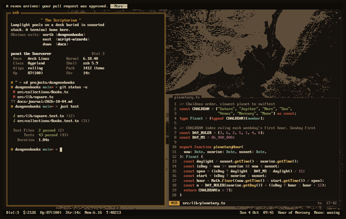
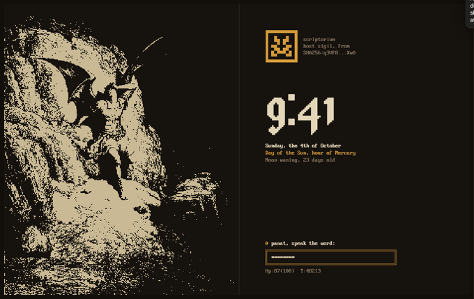

# Análisis de las imágenes de referencia

Paso de análisis de la skill `image-to-code` (secciones 8, 9 y 21 a 25). La skill pide generar las
imágenes primero; en este entorno no hay generador, así que la fuente de verdad visual son las dos
capturas que dio el usuario, guardadas en `refs/`. Lo que sigue es lo que se extrajo de ellas y a qué
parte del sitio fue a parar.

Lectura del brief (taste, sección 0.B): *portfolio de desarrollador para reclutadores y otros
devs, con el lenguaje visual de un tema de terminal retro y ocultista, hecho con CSS nativo, Tailwind
v4 para layout, fuente bitmap y grabados tramados.*

Diales: `DESIGN_VARIANCE 7`, `MOTION_INTENSITY 4`, `VISUAL_DENSITY 3`.

## Referencia 1: espacio de trabajo en la terminal

| Qué se ve | Lectura | Dónde quedó |
|---|---|---|
| Línea superior: `A raven arrives: your pull request was approved.` y `--More--` en video inverso | La terminal anuncia eventos como un juego de texto | `TopBar`: el último commit real llega "por cuervo"; `--More--` lleva al ledger |
| `~ The Scriptorium ~` en ámbar, descripción en crema, `Obvious exits: north (...), east (...)` en gris | Sala de MUD: nombre, descripción, salidas | `Career`: cada trabajo es una sala. Se conserva la forma, pero las etiquetas son literales (`Stack:`, `Links:`) porque "You carry" y "Obvious exits" no se entendían |
| `panat the Sourcerer` y tabla `Race / Class / Align / Hp` con clave ámbar y valor crema | Ficha de personaje en dos columnas | `Skills`: se conserva la forma de dos columnas, pero con etiquetas literales (`Profile` con `Role / Companies / Education / Location`) porque las de rol no decían nada del perfil profesional |
| Prompt `@ dungeonbooks main= →` y `git status` con `M`, `??` en colores | Git es parte del paisaje, no un widget | `Ledger`: log de commits con el formato de `git log --oneline` |
| Barra inferior `Dlvl:3 $:2126 Hp:87(100) ... Sun 4 Oct 09:41 Hour of Mercury Moon: waning` | Línea de estado de NetHack con datos reales del sistema | `StatusBar`: `Dlvl` es la sección visible; el resto, datos de GitHub y el almanaque |
| Grabado tramado a la derecha, en marrón apagado, detrás del editor | La imagen es textura de fondo, no ilustración | Las placas van sin marco ni tarjeta, apoyadas directo sobre el fondo |
| Paneles separados por una sola línea fina; sin sombras ni radios | La jerarquía se hace con reglas y espacio | Regla `rule` de 2px entre columnas; cero tarjetas para texto |

## Referencia 2: pantalla de bloqueo

| Qué se ve | Lectura | Dónde quedó |
|---|---|---|
| Grabado a la izquierda ocupando casi todo el alto, regla vertical fina, panel de texto a la derecha | Composición asimétrica: imagen pesada, texto liviano con mucho aire | `Hero`: grilla `512px / 2px / 1fr` |
| Sigilo de 5x5 simétrico en marco ámbar, con tres líneas grises: nombre del host, `host sigil, from`, `SHA256:q3Vf8...Xw0` | Identidad derivada de un hash | `Sigil`: se dibuja con el SHA del último commit, así cambia con cada push |
| Reloj `9:41` en blackletter pixelado, crema, enorme | Un único elemento display por pantalla | El `h1` con el nombre usa esa misma fuente (Jacquard 24); la hora pasa a la barra de estado |
| Fecha en crema fuerte, `Day of the Sun, hour of Mercury` en ámbar, `Moon waning, 23 days old` en gris | Tres líneas, tres niveles de color, mismo tamaño | Bloque de almanaque del hero, calculado para Buenos Aires |
| `@ panat, speak the word:` y campo con doble marco ámbar | La única interacción de la pantalla es escribir | `Prompt`: campo idéntico que entiende comandos (`projects`, `resume`, `plate`, `help`) |
| `Hp:87(100) T:48213` en gris bajo el campo | Texto de ayuda secundario | La respuesta del prompt vive ahí, en una región `aria-live` |

## Sistema extraído

**Color.** Fondo casi negro cálido, texto crema, un solo acento ámbar, gris cálido para lo
secundario y un tostado para la tinta de los grabados. Coincide con el esquema Srcery del
`windows-terminal.json` del usuario; los hex se tomaron de ahí, no de las capturas.

**Tipografía.** Una fuente bitmap de terminal para todo, a un solo tamaño, y una blackletter pixelada
para el único momento display. Sin negrita real: el énfasis es cambio de color.

**Espaciado.** Todo cae en la grilla de celdas de la terminal (8x16). En la web se tradujo a una
unidad de 4px y a interlineado de 24px.

**Imagen.** Grabados del siglo XIX en dos colores con tramado Floyd-Steinberg y píxel de 2x2. La
receta exacta estaba en `scripts/make-splash.ps1` del tema; `scripts/make-plates.ps1` la reutiliza.

**Componentes.** Casi no hay: reglas, texto y un campo. Por eso el pedido de claymorphism y pixel
art se resolvió como un único material nuevo, la "pixel clay", reservado para lo que se presiona
(botones, chips) y para el panel de vista previa de proyectos. Todo lo demás sigue plano como en las
referencias.

## Lo que las referencias no definían

Resuelto según el orden de la sección 28 de `image-to-code` (preservar lenguaje, layout, familia de
componentes, y recién después inventar):

- **Botones.** No hay ninguno en las capturas. Se diseñaron como pixel clay (ver `DESIGN.md`, sección 4).
- **Capturas de proyectos.** Se traman con la misma receta que los grabados para que no rompan la
  paleta; el original a color aparece al pasar el mouse o con "Develop Plate".
- **Datos de contribuciones.** Cinco niveles de intensidad dibujados como densidad de tramado
  (0, 25, 50, 75, 100%) en vez de cinco tonos, que no existen en una paleta de dos colores.
- **Mobile.** Las referencias son de escritorio. En una columna el grabado va arriba, recortado, y
  la barra de estado se reduce a nivel y hora.
